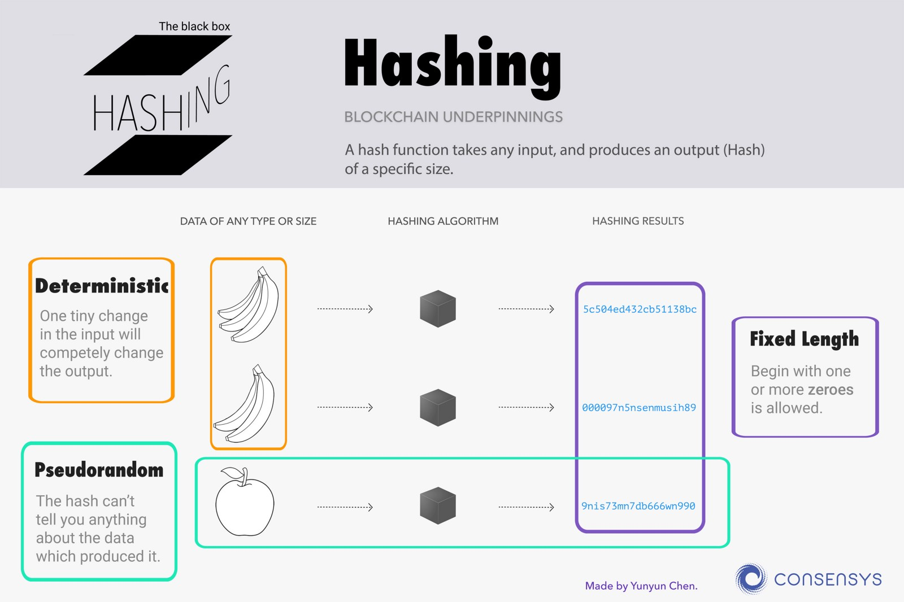

# Blockchain Basics

So far, we have discussed the impressive implications of blockchain technology. We will now simply and concisely explain how the technology works to make it transparent and immutable across all users.

The blockchain is a digital ledger that operates via a network of computers. Data added to the blockchain is visible to everyone participating. When a transaction is carried out on the blockchain, it is added to a cryptographically encoded "block" with all the other transactions that occurred in the last ten minutes \(for the Bitcoin network\) and shared with the entire network of computers. Members of the network with participating computers, otherwise known as **miners**, compete to solve these cryptographic puzzles to validate the transaction. The first miner to decode the puzzle receives a small reward from the network for their work. The puzzle is difficult to solve, so in order to solve the puzzle fast enough to receive the reward, a miner will use powerful computers. When Bitcoin was first launched, it was possible to use a laptop purchased in a store for mining. That is no longer the case.

This ‘validation’ is in the form of reviewing cryptographic inputs, outputs and a timestamp, which then allows validated blocks to be linked to older validated blocks. This forms a chain of blocks that show every transaction made on the blockchain. This chain is updated and is made accessible to every member on the platform. This decentralized quality allows for transparency and immutability - that anyone on the platform has the ability to view any data added to the network.

## Hashing and Public Key Cryptography

A blockchain uses hash functions in order to create an immutable record of what is written to it, as well as to create "digital signatures". A hash function is a digital mechanism that is used to compress data into a specific format. The hashing algorithm used by the Bitcoin blockchain is SHA-256. In this hash, the hashed data is always 256 bits long. The Ethereum blockchain uses a hashing algorithm called [Ethash](https://github.com/ethereum/wiki/wiki/Ethash). A hash created using Ethash will look like:

```text
0xb846300e188829d1b819389b31cef3b9cfaf335082ee66f830a875f1c1beb396
```

The above hash is from block 5000171 mined at Jan-30-2018 02:20:28 PM +UTC on the Ethereum blockchain. More data on this block can be found at [Etherscan.](https://etherscan.io/block/5000171)

This hashed data is used on the blockchain to indicate value and the links between each specific blocks. In addition to hashing, the blockchain relies on public key cryptography to encode information securely - the digital signatures we referred to in the above paragraph. Specifically, participants on the blockchain have a private code - called private keys - that allow them to access their information which is encoded with a public code - called a public key. The public and private key are related, but a malicious actor cannot derive the private key from the visible public key. Private keys are not meant to be shared since a private key is used to unlock its associated public key. These keys sign transactions on the blockchain.

Yunyun Chen of ConsenSys created an excellent visual explaining hashing in [Guide: Hashing](https://media.consensys.net/guide-hashing-33dc0467c126) and how it is a part of public key cryptography in [Guide: An Introduction to Encryption](https://media.consensys.net/guide-an-introduction-to-encryption-9afd17f5da6d). Both graphics are reproduced below:




Hashing and public key cryptography work hand in hand to maintain consensus in the system. Through consensus, the entire system has common knowledge of the happenings on the platform and any action is recorded and made available for the platform to view. This solves the issue of a trustless system with intermediaries because now, participants on the blockchain have constant verification on the platform. The process of miners verifying actions on the blockchain is known as **proof of work**. Mining ensures that the constant state of the ledger has transactions that are all true. This prevents attacks and false information from perpetuating within the system, ensuring lasting validity.

